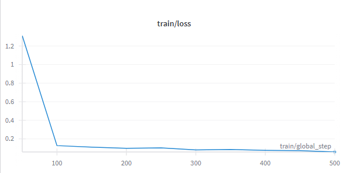
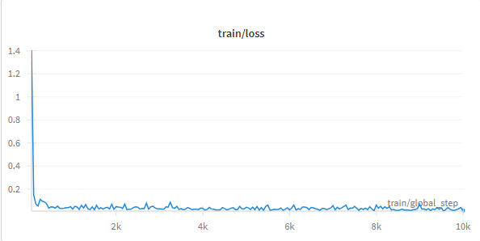

# Codeuctivity – Smarter Code Summaries via LoRA-fine-tuned CodeT5

[](https://www.python.org/)
[](https://huggingface.co/)
[](https://wandb.ai)
[](LICENSE)
[]()

---

## Overview

**Codeuctivity** is an efficient, transformer-powered summarization tool that helps developers understand their code better by converting functions into natural-language explanations. Behind the scenes, we fine-tune Salesforce’s open-source `CodeT5` model using **LoRA**, enabling lightweight, high-performance adaptation for code-to-docstring generation.

---

## Why It Matters

- **Boost developer productivity**: Auto-generate meaningful summaries to ease onboarding and documentation.  
- **Efficient fine-tuning**: By freezing most of the model and applying LoRA adapters, only ~0.8% of parameters are actually trained — fast and resource-friendly.  
- **Modern foundation**: Built on the powerful CodeT5 model, which sets SOTA benchmarks in code understanding and generation tasks.  

📖 Original CodeT5 Paper: *CodeT5: Identifier-aware Unified Pre-trained Encoder-Decoder Models for Code Understanding and Generation*, Wang et al., EMNLP 2021.  
[Read on arXiv](https://arxiv.org/abs/2109.00859)

---

## Features

- Fine-tuned `Salesforce/codeT5-base` with LoRA adapter (r=16, α=32, dropout=0.1).  
- Trained on the `code_x_glue_ct_code_to_text` (Python subset) dataset for code-to-docstring summarization.  
- Trainer pipeline using HuggingFace `Trainer` API with logging to Weights & Biases.  
- Lightweight inference helper: `.summarize(code)` returns a human-readable summary.  

---

## Architecture & Workflow

1. **Dataset**  
   - HuggingFace dataset: `code_x_glue_ct_code_to_text` (Python).  
   - Splits: Training ~251K, Validation ~13K, Test ~15K.  

2. **Tokenization & Preprocessing**  
   - Prompt format: `"summarize: {code}"`  
   - Max input length: 128  
   - Max output length: 64  

3. **Model & LoRA Configuration**  
   - Base model: `Salesforce/codet5-base`  
   - LoRA adapters train only ~0.787% of parameters.  

4. **Training Setup**  
   - Batch size: 4  
   - Learning rate: 5e-4  
   - Epochs: 1 (pilot run)  
   - Logging/Evaluation: per-epoch with W&B tracking  

5. **Inference**  
   - `.summarize(code)` → docstring output using `model.generate(...)`.  

   **Example:**
   ```python
   def summarize(code):
       inputs = tokenizer(f"summarize: {code}", return_tensors="pt", truncation=True).to(model.device)
       output = model.generate(**inputs, max_length=MAX_OUTPUT)
       return tokenizer.decode(output[0], skip_special_tokens=True)

   print("\n Test prediction:")
   print(summarize("def factorial(n): return 1 if n==0 else n*factorial(n-1)"))
   ```

   **Output:**
   ```
   Test prediction:
   This function calculates the factorial of a number using recursion. If n is 0, it returns 1, otherwise it multiplies n by the factorial of (n-1).
   ```

---

## Training & Evaluation

We conducted two key runs:

1. **Trial Run (500 steps)**  
   - Purpose: Sanity check, pipeline validation.  
   - Results: Quick convergence, indicative of learning capacity.  

   📈 

2. **Full Run (10,000 steps)**  
   - Purpose: Main training, improved generalization.  
   - Results: Lower validation loss, stronger summaries.  

   📉 
- **Final Metrics**  
  - Training Loss: ~0.0137  
  - Validation Loss: ~0.0654  
  

---

## Quick Start

Clone the repo and run:

```bash
git clone <repo-url>
cd codeuctivity
pip install -r requirements.txt  # includes transformers, peft, datasets, wandb, etc.
```

---

## License

This project is licensed under the MIT License. See [LICENSE](LICENSE) for details.

---
