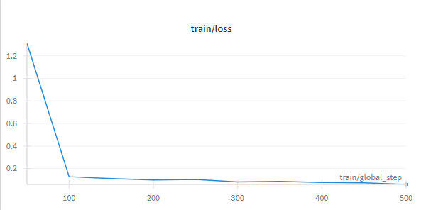
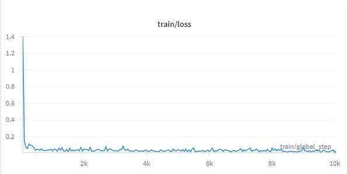

# Codeuctivity

LoRA fine-tuned [Salesforce/codet5-base](https://huggingface.co/Salesforce/codet5-base) for automatic Python code summarization. The model takes a function's source code and generates a natural language docstring. It trains only 0.787% of parameters (1.77M of 224M) using [LoRA adapters](https://arxiv.org/abs/2106.09685), making fine-tuning feasible on a single GPU.

## Setup

```bash
make setup
```

Requires Python 3.10+ and [uv](https://github.com/astral-sh/uv).

Copy `.env.example` to `.env` and fill in your keys:

```bash
cp .env.example .env
```

## Usage

### Quick test (500 steps)

```bash
make train-trial
```

### Full training run (replicates original 10,000-step run)

```bash
make train-full
```

### Inference

```bash
make summarize
# or with a specific snippet:
python scripts/summarize.py --code "def factorial(n): return 1 if n==0 else n*factorial(n-1)"
```

### End-to-end pipeline

```bash
python scripts/run_pipeline.py --config configs/trial.yaml
```

## Programmatic usage

```python
from codeuctivity.inference import summarize

print(summarize("def factorial(n): return 1 if n==0 else n*factorial(n-1)"))
# This function calculates the factorial of a number using recursion.
```

## Results

### Trial run (500 steps)



### Full run (10,000 steps)



| Metric | Value |
|---|---|
| Training loss (final) | ~0.0137 |
| Validation loss | ~0.0654 |
| Training steps | 10,000 |
| Runtime | 2,212.6 s (~37 min) |
| Samples/sec | 18.08 |
| Steps/sec | 4.52 |

### Inference example

```
Input:  def factorial(n): return 1 if n==0 else n*factorial(n-1)
Output: This function calculates the factorial of a number using recursion.
        If n is 0, it returns 1, otherwise it multiplies n by the factorial of (n-1).
```

## Project structure

```
codeuctivity/
    src/codeuctivity/
        data/           dataset loading and tokenization
        model/          LoRA config and model loading
        training/       HuggingFace Trainer wrapper
        inference/      Summarizer class and convenience function
        utils/          YAML config loader
    scripts/
        train.py        train from a config file
        evaluate.py     evaluate on the test split
        summarize.py    interactive or batch inference
        run_pipeline.py end-to-end: train + eval + demo
    configs/
        trial.yaml      500-step trial run
        full.yaml       10,000-step full run
    tests/              unit tests for data and inference
    docs/               architecture notes
    assets/             training curve images
```

## Technical background

**CodeT5** (Wang et al., EMNLP 2021) is an encoder-decoder Transformer pre-trained on code with identifier-aware objectives. It achieves strong performance on code understanding and generation tasks.

- Paper: [CodeT5: Identifier-aware Unified Pre-trained Encoder-Decoder Models for Code Understanding and Generation](https://arxiv.org/abs/2109.00859)

**LoRA** (Hu et al., 2021) reduces trainable parameters by injecting low-rank update matrices into attention layers. For rank r=16 and scaling alpha=32, only 1.77M of 224M parameters are trained.

- Paper: [LoRA: Low-Rank Adaptation of Large Language Models](https://arxiv.org/abs/2106.09685)

### Model stats

| Parameter | Value |
|---|---|
| Base model | Salesforce/codet5-base |
| Total parameters | 224,651,520 |
| Trainable (LoRA) | 1,769,472 |
| Trainable % | 0.787% |
| LoRA rank (r) | 16 |
| LoRA alpha | 32 |
| LoRA dropout | 0.1 |
